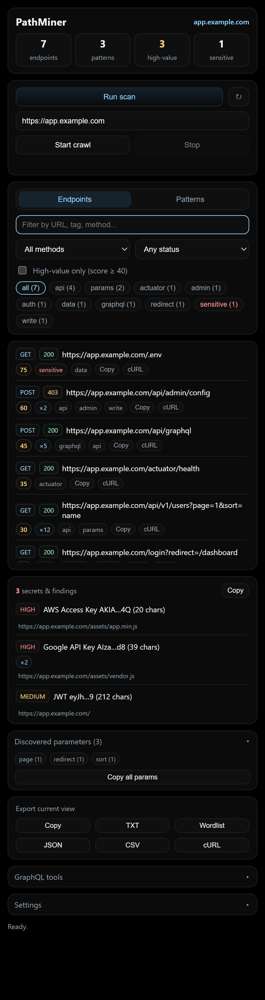
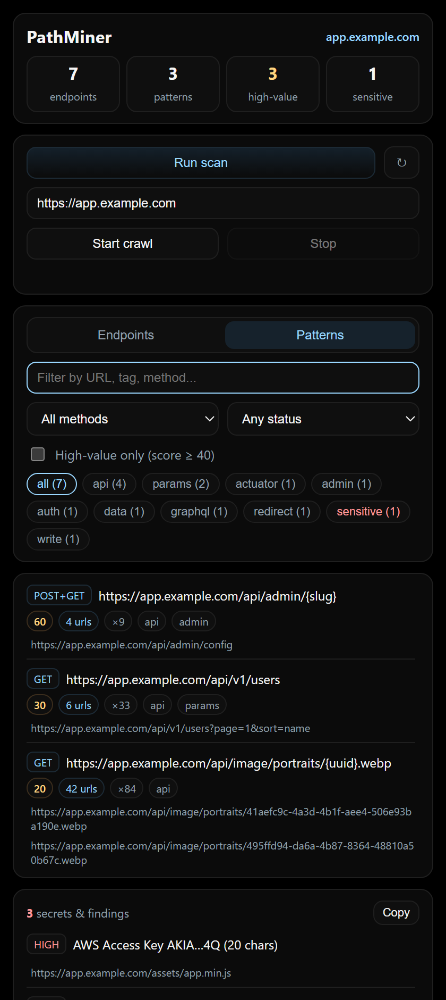
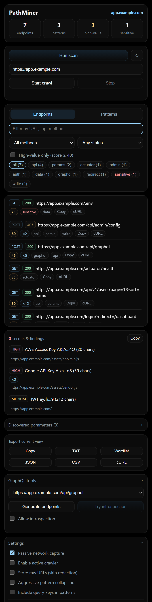

# PathMiner

A fast, local‑first Chrome (MV3) extension for **endpoint discovery, scoring, and exploration** during authorized security testing and recon. PathMiner watches traffic, mines paths from the DOM and JavaScript, groups them into route patterns, flags high‑value and sensitive endpoints, surfaces leaked secrets, and exports everything in the formats your other tools expect — all without sending your data anywhere.

> **v2.0** — major release. See the [Changelog](#changelog).

## Screenshots

| Endpoints & findings | Pattern grouping | Settings & tools |
| --- | --- | --- |
|  |  |  |

Data shown is synthetic (`app.example.com`) for illustration.

## Features

**Discovery**
- **Passive network capture** (`webRequest`) with method, status, content type, size, and timing.
- **On‑demand in‑page scan** that mines paths from the DOM and every linked script, then feeds same‑origin results back into the scored workspace (not just a modal).
- **Page‑level `fetch`/`XHR` hook** (activated only when you click *Run scan*), relayed through a nonce‑guarded bridge.
- **Active crawler** with configurable depth, page cap, delay, and concurrency, driven from the popup with live progress.

**Understanding**
- **Endpoint scoring + tags**: `api`, `auth`, `admin`, `graphql`, `docs`, `upload`, `payment`, `webhook`, `params`, `write`, plus **`sensitive`** (`.env`, `.git`, backups, keys, `wp-config`…) and **`actuator`** (Spring actuator, `metrics`, `phpinfo`, heap/thread dumps).
- **Pattern view**: collapses concrete URLs into templates like `/users/{id}` and `/orders/{uuid}` with per‑pattern counts, methods, tags, and example URLs.
- **Secret detection**: scans script and page content for AWS/GCP/GitHub/Slack/Stripe keys, Google OAuth client IDs, JWTs, and private keys. Only **masked metadata** (type, source, redacted preview) is stored — never the raw secret.
- **Parameter mining**: aggregates every query‑string key seen across the site, one click to filter or copy for fuzzing.

**Workflow**
- **Live filtering**: search box + method / status‑class / tag filters + a *high‑value only* toggle, with dynamic tag chips showing counts.
- **Export** the current filtered view as **Copy / TXT / JSON / CSV / cURL / Wordlist**, plus per‑row *Copy* and *cURL*.
- **Toolbar badge** shows the high‑value endpoint count for the active tab’s host at a glance.
- **Workspace‑scoped storage** keyed by hostname with bounded retention, plus one‑click *Clear this site’s data*.
- **OpenAPI JSON parsing** and optional **GraphQL tools** (endpoint guesses + introspection).

**Privacy & safety**
- Everything runs and stays local (`chrome.storage.local`). No data leaves the browser.
- **URLs are redacted by default** (JWTs, tokens, keys, passwords) before storage — toggleable in Settings.
- No headers, cookies, or bodies are ever stored.
- Hooking, crawling, OpenAPI parsing, and GraphQL introspection run **only when you trigger them**.

## Installation
1. Clone or download this repo.
2. Open Chrome → Extensions → enable **Developer Mode**.
3. Click **Load unpacked** and select the PathMiner folder.

## Usage
- Open the popup on any page. The header shows the host and live counts (endpoints, patterns, high‑value, sensitive).
- Click **Run scan** to inject hooks and mine paths from the DOM and scripts; results stream into the list and any secrets appear under **Secrets & findings**.
- Toggle between the **Endpoints** and **Patterns** views.
- Use the search box and the method / status / tag filters to narrow results; enable **High‑value only** to focus.
- Click a row’s URL to open it, or use **Copy** / **cURL** on any row.
- Start an **active crawl** from the second card (auto‑enables the crawler); watch progress and stop anytime.
- **Export** the current view via Copy / TXT / JSON / CSV / cURL / Wordlist.
- **Parse OpenAPI** on docs endpoints, or use **GraphQL tools** to guess endpoints and test introspection.
- Tune behavior and **clear the current site’s data** under **Settings**.

> Use PathMiner only against systems you are authorized to test.

## Architecture
- `background.js` — MV3 service worker: passive capture, scoring, pattern engine, crawler, OpenAPI/GraphQL, secret‑finding storage, and the toolbar badge.
- `popup.html` / `popup.js` — the UI, filtering/exports, and the injected page bridge, `fetch`/`XHR` hook, and path/secret scanner.
- `manifest.json` — MV3 manifest (`scripting`, `activeTab`, `storage`, `webRequest`, `<all_urls>`).

## Changelog

### 2.0.0
- **Secret detection**: AWS/GCP/GitHub/Slack/Stripe/OAuth/JWT/private‑key scanning during in‑page scans, stored as masked metadata only.
- **Parameter mining** panel aggregating query keys across the site.
- **New exports**: cURL script and fuzzing Wordlist, plus per‑row cURL.
- **Toolbar badge** with the active host’s high‑value count.
- **Security**: nonce‑guarded page→worker bridge and strict sender validation on hook events.
- **Bug fix**: findings from third‑party scripts are now correctly attributed to the current site.
- Debounced search, keyboard focus/Esc, and layout polish.

### 1.1.0
- **Critical fix**: an invalid regex in `extractUrlsFromHtml` had been throwing at parse time and preventing the background service worker from loading at all.
- Rebuilt the popup: stats header, Endpoints/Patterns views, search + method/status/tag filters, high‑value filter.
- In‑page scan results now populate the scored workspace via the background worker.
- Copy/JSON/CSV/TXT export; surfaced the crawler, all settings, and per‑site clear.
- Sensitive‑file, debug‑surface, payment, and webhook scoring heuristics.
- Guaranteed a trailing workspace‑update notification so the popup never misses the final state.

### 1.0
- Passive capture + on‑demand page hook for fetch/XHR.
- OpenAPI parsing and endpoint scoring.
- Popup UI with display‑side dedupe.
